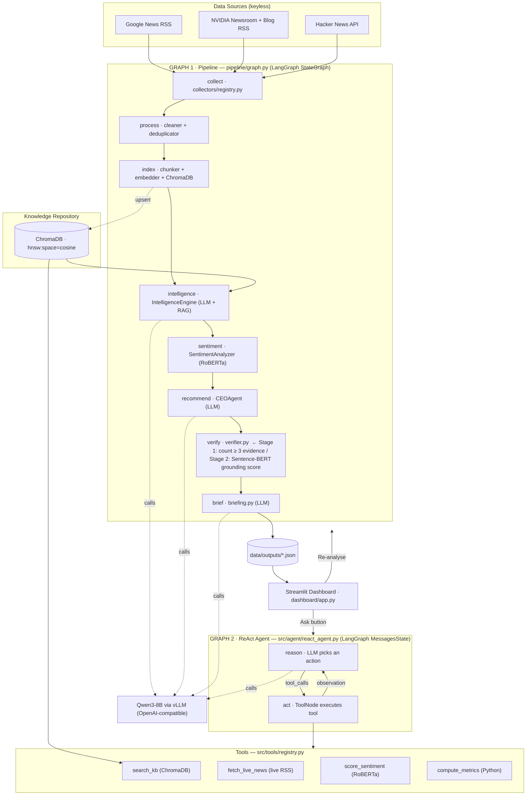

# Architecture

## Two-graph overview

The system is built on two explicit LangGraph graphs:

- **Graph 1** (`pipeline/graph.py`) — offline pipeline, runs once to build/refresh the knowledge base and analysis artifacts.
- **Graph 2** (`src/agent/react_agent.py`) — live ReAct agent loop, fires on every "Ask" click in the dashboard.



## PipelineState — what flows between Graph 1 nodes

```
PipelineState {
  cfg          — config dict
  embedder     — Embedder instance
  llm          — LLMClient instance
  docs         — raw collected documents        [after collect]
  processed    — cleaned + deduped documents    [after process]
  intelligence — {opportunities, risks, trends} [after intelligence]
  sentiment    — {overall, by_source, trend}    [after sentiment]
  recommendations — verified recs only          [after verify]
  verification — {passed, failed, rejected}     [after verify]
  briefing     — {what_happened, …}             [after brief]
}
```

## Graph 2 — ReAct loop detail

```
User question
      │
      ▼
  reason node ──► LLM + tool schemas
      │
      ├─ tool_calls? ──► act node ──► ToolNode runs tool ──► observation ──┐
      │                                                                      │
      └─ no tool_calls? ──► END (final answer)          ◄────────────────────┘
```

The LLM's system prompt instructs it to:
1. Always call `search_kb` first.
2. If results are thin, call `fetch_live_news`.
3. Optionally call `score_sentiment` or `compute_metrics` for additional context.
4. Then produce a grounded final answer.

## Data flow (artifact-level)

```
collectors ──HTTP──► data/raw/documents.json
                              │
                    process_node: clean + dedupe
                              │
                    data/processed/clean.json
                              │
                    index_node: chunk + embed + ChromaDB
                              │
                    data/processed/chunks.json
                    data/chroma/ (ChromaDB)
                              │
              ┌───────────────┴───────────────┐
              ▼                               ▼
     intelligence_node              sentiment_node
     (LLM × 3 passes)               (RoBERTa)
              │                               │
     data/outputs/intelligence.json  data/outputs/sentiment.json
              │
     recommend_node (LLM)
              │
     verify_node (Python gate)
              │
     data/outputs/recommendations.json
     data/outputs/verification.json
              │
     brief_node (LLM)
              │
     data/outputs/briefing.json
              │
     Streamlit dashboard reads all *.json
     "Ask" fires Graph 2 (ReAct loop) live
```

## Technology stack

| Component | Technology |
|---|---|
| Collection | `requests`, `feedparser`, `beautifulsoup4` |
| Embeddings | `sentence-transformers/all-MiniLM-L6-v2` (384-dim, L2-normalised) |
| Vector store | ChromaDB (persistent, cosine index) |
| Sentiment | `cardiffnlp/twitter-roberta-base-sentiment-latest` (RoBERTa 3-class) |
| LLM | Qwen3-8B via vLLM OpenAI-compatible endpoint or in-process Transformers |
| Agent framework | **LangGraph** — `StateGraph` (Graph 1) + `MessagesState` (Graph 2) |
| Tool calling | `langchain-openai` `ChatOpenAI.bind_tools()` + `ToolNode` |
| Dashboard | Streamlit + Plotly |
