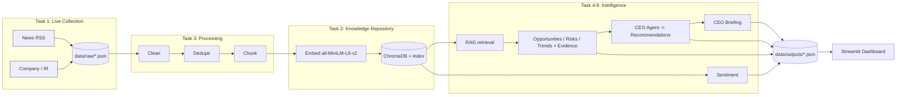

# Architecture

## System architecture

## Data flow
1. Collectors emit canonical `Document`s -> `data/raw/documents.json`
2. Clean + dedupe -> `data/processed/clean.json`
3. Chunk + embed + index -> ChromaDB (`data/chroma/`)
4. Intelligence engine + sentiment -> `data/outputs/intelligence.json`
5. CEO agent -> `data/outputs/recommendations.json`
6. Briefing -> `data/outputs/briefing.json`
7. Dashboard reads the outputs.

## Technology stack
- Python 3.11
- Collection: requests, feedparser, beautifulsoup4
- Store/retrieval: ChromaDB + sentence-transformers (all-MiniLM-L6-v2), RAG
- LLM: open model (Qwen3-8B) in-process via transformers, or an OpenAI-compatible endpoint (Ollama / vLLM)
- Dashboard: Streamlit + Plotly — 9 views: Strategic Advisor (live Q&A), Overview, Market
  Intelligence (incl. emerging tech & trends), Opportunities, Risks, Trends, Sentiment
  (distribution donut / news-vs-public / by-source / trend), Recommendations, CEO Briefing

## Design decisions
- Single OpenAI-compatible `LLMClient` -> local Ollama and the Frankfurt
  server share one code path; the "no paid API" rule is enforced in one file.
- JSON artifact at every stage -> inspectable, resumable, demo-friendly.
- One collector class per source behind a `BaseCollector` -> add/remove
  sources without touching the pipeline.
- Stable doc ids (hash of url|title) -> dedup is trivial and idempotent.

## AI pipeline
RAG (semantic retrieval over chunked docs) feeds structured prompts
(`src/agent/prompts.py`); the LLM returns JSON findings; the CEO agent reasons
over those findings to produce prioritised, evidence-cited recommendations and
the executive briefing.
